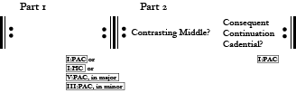
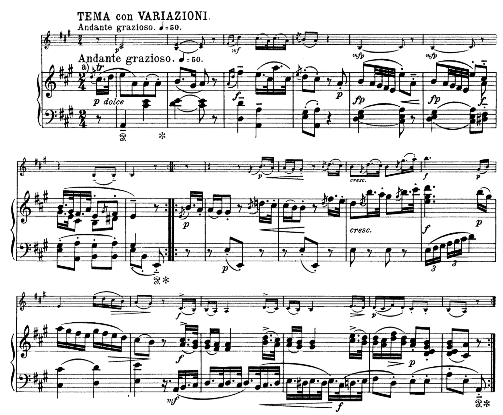

# The small binary

The small binary often fulfills a structural role similar to that as the small ternary. It can be the main theme of any of the full-movement forms, but is most often found as the theme of a theme and variations, [rondo](ch-067-thematic-function-in-rondo.md), or the [minuet and trio](ch-070-minuet.md).

Small binaries have two parts, each of which is usually repeated. Unlike the ["rounded binary,"](ch-052-small-ternary.md##Binary characteristics) small binaries *do not* include a recapitulation of the material heard in the *first part*.

<figure>	
  
  <figcaption>The small binary</figcaption>
</figure> 

## First part
Typically constructed as tight-knit [period](ch-048-period.md), [sentence](ch-047-sentence.md), or [hybrid](ch-049-hybrid-themes.md), the *first part* ends with cadential articulation in the home key or a closely related one. Because a small binary is often smaller than that of the *small ternary,* it is not uncommon to find a I:HC at the close of the first part.

### Second part
The *second part* of a small binary quite often begins like a contrasting middle. The material that *follows* the *contrasting middle*, however, is not a *recapitulation*. If it were, the theme would be a [small ternary](ch-052-small-ternary.md). Rather, this material takes on a variety of guises. Often, it resembles one of the common "after-phrases"--*continuation*, *consequent,* or *cadential.* In the classical style, the second part of a small binary will always close with a I:PAC.

### An example

<figure>	
  
  <figcaption>Mozart, Violin Sonata in A major, K. 305</figcaption>
</figure> 

In this small binary, the *first part* is created by a simple period that modulates to and closes in the dominant key with a V:PAC. A *contrasting middle* follows, where we see a typical ["standing on the dominant"](ch-056-external-expansions.md#suffix) to support a prolongation of V7. Notice that the motivic material in the *contrasting middle* is quite similar to the motivic material we hear in the *first part.* This is typical of a small binary, whose *second part* does not contrast with the *first part* to such a high degree as in the *small ternary.* Following the *contrasting middle*, the final four measures of this example resemble a continuation: the melodic motive we hear in the *contrasting material* is fragmented and sequenced, and begins, with the pickup to the penultimate measure, a cadence.
