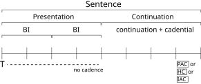
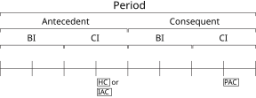
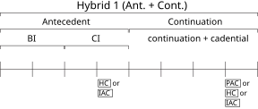
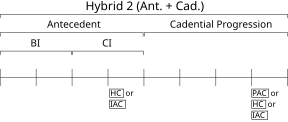
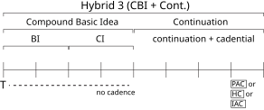
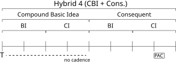
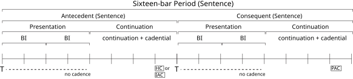
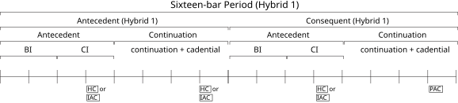
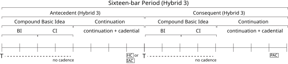
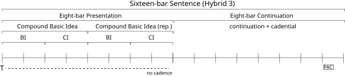

# Classical theme types

The following diagrams outline the key internal characteristics and functional role of the various theme types presented in William Caplin’s [*Classical Form*.](https://openlibrary.org/works/OL2689355W/Classical_form) Follow the links below for further explanation and examples.

See also [Classical theme functions](ch-055-theme-functions.md).

Sentence
--------

For details, click [here](ch-047-sentence.md).

Period
------

For details, click [here](ch-048-period.md).

Hybrid themes
-------------

For further details, click [here](ch-049-hybrid-themes.md).

Compound themes
---------------

For further details, see [Compound periods](ch-050-compound-period.md) and [Compound sentences](ch-051-compound-sentence.md).

Small Ternary
---------------

For further details, click [here](ch-052-small-ternary.md).

Small Binary
---------------

For further details, click [here](ch-053-small-binary.md).

